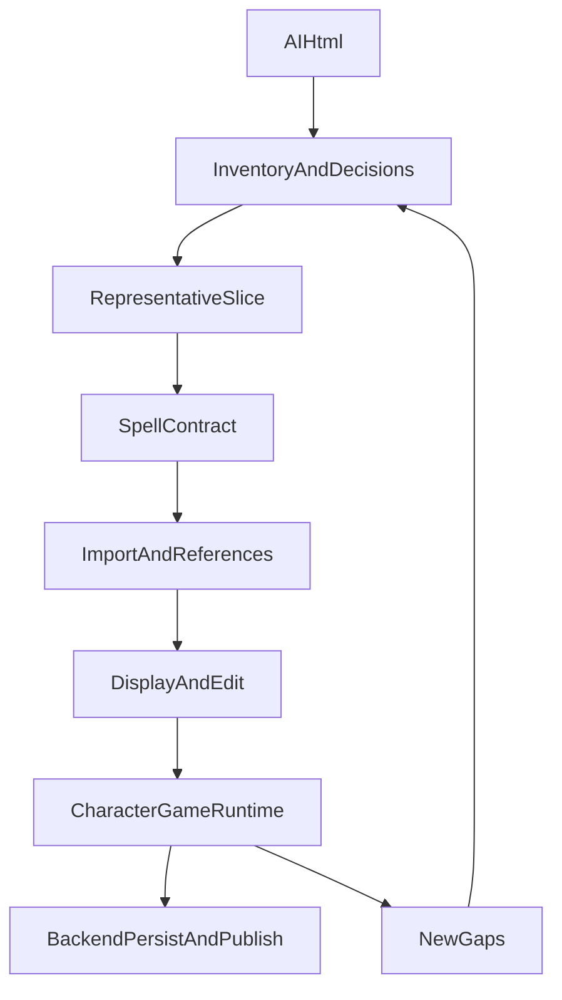

# Нарезка магии и заклинаний

**Статус:** план, 2026-09-07. Источник первого захода — [`docs/rule/spell/AI.html`](../rule/spell/AI.html). Канон границ — [`rule-system.md`](rule-system.md), [`architecture.md`](architecture.md), [`decisions.md`](decisions.md). Параметры — [`../specs/ability-parameters.md`](../specs/ability-parameters.md).

Цель линии: выгрузить репрезентативный срез большой системы магии, встроить его в текущую модель `Rule/Ability`, затем по фактам расширять `Character`/`Game` и backend. Roadmap живой: после каждого среза в него добавляются обнаруженные зависимости, противоречия и новые решения.

Полноценная реализация заклинаний обязательна до релиза (`DEC-023`). Полный каталог и runtime-механики сотворения остаются `DEFERRED` (`DEC-039`, `DEC-056`) до прохождения срезов. Срез Rule + изучение в редакторе персонажа уже есть; наличие `spell` в DTO не означает готовность backend или Game-каста.

## 0. Текущее состояние и границы

### Что уже есть

- `AbilityType = 'spell'`; урон в `spell.damage`; `hit_resolution` (`none` / `attack` / `auto`).
- `SpellSpec` без stored сложности: мощь, контроль, duration.
- Сотворение — `action_components` (ОД + соматика); `occupy_hands` у соматики.
- Duration: `instant` / `lingering` / `refreshable` / `sustained`; у `sustained` своя `power` (не мощь сотворения).
- Простое правило `spell-sustaining` («Поддержание заклинаний») — общая механика поддержания, не текст отдельного заклинания.
- Улучшение конкретного заклинания — `type: 'skill'` + `spell_upgrade` + `parent_ability_code` (+ `multiple`). Модификатор любого каста пути (Аккуратное волшебство) — тот же `spell_upgrade` **без** родителя, `multiple` + `domain_ref: 'magic-path'`.
- Редактор, карточка, overview; параметры покупки/активации и размерные значения.
- Изучение волшебства в редакторе персонажа: грант `magic_study` с обязательным `path_code` (грант без пути **не** открывает все дарованные пути); экземпляры пути; слот пробуждения (`max_instances` + `paid_cost: 0`).
Keyword `has_ability_keyword magic-path` на заклинаниях среза снят: изучение открывает грант `magic_study` на входных навыках пути.

### Что показал первый источник

Выгрузка содержит несколько разных доменов, а не только список заклинаний:

- источник магии: магическое ядро, кристалл, накопители и проводники;
- путь магии: Арканист, Псионик, Шаман;
- две величины сотворения: Магическая мощь и Контроль магии;
- правила выбора source/path при каждом сотворении;
- изучение, опыт пути и ограничения стоимости;
- время создания, компоненты, мгновенное/длительное/обновляемое/поддерживаемое действие;
- сложность, сопротивление, провал и магическое отклонение;
- Арканный урон как часть первого runtime-среза;
- электрический урон и состояние «Шок» для выбранного заклинания;
- заклинания, улучшения, требования и цепочки улучшений;
- эффекты электрического урона и состояние «Шок».

Это не означает, что все перечисленные понятия должны стать DTO первого среза. Сначала фиксируется контент и уровень уверенности, затем выбираются минимальные структурированные поля.

### Не смешивать

- **Контент Rule** — определения источников, путей, навыков, заклинаний, улучшений и их описаний.
- **Экземпляр Character** — изученные способности, выбранные параметры, доступные источники и текущие ограничения.
- **Сотворение Game** — выбранные на этот cast source/path, расчёт сложности, бросок, стоимость, время и результат.
- **Backend** — хранение/публикация определений, проверка ссылок и повторная валидация производных расчётов.

Путь выбирается при каждом сотворении и не хранится как единственный путь изучения (`DEC-032`). Runtime-поддержка хранится отдельно от `contentStatus` (`DEC-055`).

## 1. Матрица готовности

Статусы осей независимы:

- `content` — данные извлечены, нормализованы и имеют разрешённые ссылки;
- `domain/frontend` — DTO, сервисы, редактор и отображение;
- `runtime` — Character/Game умеют применить механику;
- `backend` — серверный контракт, persist, publish и повторная validation.

| Контур | Сейчас | Цель первого среза | Примечание |
| --- | --- | --- | --- |
| `spell` как Ability | `PARTIAL` | `IMPLEMENTED` для выбранного slice | текущая модель минимальна |
| Заклинания из `AI.html` | `DEFERRED` | `MOCK_ONLY` → `IMPLEMENTED` по партиям | источник местами противоречив |
| Пути и источники | `PARTIAL` (мок + редактор) | content + отображение | runtime каста — M6; `includes_path_codes` уже в редакторе |
| Сложность сотворения | `DEFERRED` | доменный pure service | не вычислять в Vue |
| Эффекты заклинаний | `DEFERRED` | один успешный и один failure-кейс | остальные отображаются |
| Backend Rule | `OPEN` | после стабилизации slice | не переносить гипотезы заранее |

## 2. Фаза A — inventory и рабочий срез

### A1. Инвентарь источника

Разобрать `AI.html` в таблицу сущностей:

- устойчивый `code`, имя, тип, описание и исходный фрагмент;
- keywords и принадлежность к пути/школе;
- стоимость, требования, grants, параметры;
- связи `parent_ability_code`, улучшения и совместимые заклинания;
- ссылки на характеристики, ресурсы, damage/state и предметы;
- `disposition`: `import`, `text-only`, `defer`, `needs-decision`;
- уровень уверенности и конфликтующие места источника.

Исходный HTML остаётся evidence, а не runtime-форматом. Коды и ссылки в нормализованных данных — семантические, не numeric `id`.

### A2. Репрезентативный vertical slice

Первый slice должен покрыть разные формы:

1. один источник магии;
2. один путь, предпочтительно Арканист как наиболее прямой для первого check-flow;
3. одно мгновенное заклинание;
4. одно поддерживаемое или обновляемое заклинание;
5. одно улучшение с `parent_ability_code`;
6. один параметр `purchase` и один параметр `activation` в декларативном виде;
7. один damage/state-эффект;
8. один сценарий провала.

Первые кандидаты и посадка на код — [`spell-plan-02-slice.md`](spell-plan-02-slice.md): источник это `item`, не `RuleType.source`; параметры это `AbilityParameter`; урон через `AttackDamageService`.

### A3. Журнал открытых вопросов

Не скрывать в DTO неоднозначности:

- являются ли `Мощь` и `Контроль` отдельными характеристиками, ресурсами или derived-контуром;
- как кодируются «Создание» в секундах/ОД и его конвертация;
- является ли `Длительное` отдельным duration type или параметром текущей `instant/refreshable/sustained`;
- как выбирать источник при нескольких источниках и как хранить их состояние;
- что именно означает РУ в проверке и эффекте;
- какие части магического отклонения, разрушения и дестабилизации нужны в первом runtime;
- какие механики являются общими, а какие принадлежат конкретной школе/пути.

Каждый закрытый вопрос получает запись в `decisions.md` или в профильном design-документе. Нерешённое остаётся `OPEN`/`DEFERRED`.

## 3. Фаза B — контракт Rule/Ability

### B1. Расширить только подтверждённые поля

Сверить и при необходимости расширить `SpellSpec`:

- требования к Магической мощи и Контролю;
- время создания;
- длительность и данные конкретного режима;
- компоненты и их типы;
- ссылки на источник/путь только там, где это действительно свойство правила;
- структурированные параметры и level/upgrades, которые уже поддерживает `AbilitySpec`.

Универсальные `action_costs`, `requirements`, `grants`, `keywords` и `parent_ability_code` не дублировать в `SpellSpec`.

### B2. Границы параметров

Использовать существующую модель параметров:

- `purchase` — значение выбрано при изучении/покупке и хранится у способности персонажа;
- `activation` — значение выбирается на конкретном cast и не требует хранения в Character до появления активации;
- размерные числа проходят через доменные операции, не через `toNumber()` и строковую арифметику;
- `{code}` в описании остаётся отдельным optional-заходом и не блокирует первый импорт.

### B3. Типизированная validation

Добавить проверки по мере подтверждения контракта:

- обязательные spell-поля и совместимость duration;
- существование ссылок по `code` и ожидаемый RuleType;
- компоненты и материальные предметы;
- корректность параметров, диапазонов и размерных значений;
- цепочки улучшений без циклов;
- совместимость spell/action fields с manifest/prune.

Ошибки должны иметь `code/path/stage`, а исходное описание не должно теряться из-за неподдержанной структурированной части.

## 4. Фаза C — нормализованный импорт и контент

### C1. Промежуточный формат

В `docs/rule/spell/` завести нормализованный слой импорта с полями:

- source locator и оригинальный текст;
- canonical `code`;
- normalized rule/spec;
- unresolved references;
- disposition и confidence;
- комментарий по ручному решению.

Формат должен позволять повторный импорт без ручного редактирования сгенерированных данных.

### C2. Порядок партий

1. базовые характеристики, ресурсы и points;
2. источники магии и пути;
3. damage/state и общие keywords;
4. общие магические навыки;
5. заклинания первого slice;
6. улучшения и связи;
7. остальные заклинания партиями по школам/путям.

Каждая партия замыкает собственные ссылки и не требует загрузки всего будущего каталога, кроме явно задокументированных deferred-ссылок.

### C3. Fixture и revision file

- Сгенерировать mock catalog и fixture для revision export/import.
- Проверить, что используются только `code`, без внутренних `id`/`spaceId`.
- Прогнать preview/import/publish для среза.
- Неподдержанные runtime-поля должны сохраняться как контент/описание, а не молча отбрасываться.

## 5. Фаза D — frontend отображения и редактор

Цель этой фазы — корректно редактировать и показывать контент slice, не симулировать игру.

- расширить `SpellEditor` по подтверждённым полям;
- отобразить мощь/контроль, создание, duration, components, requirements и upgrades;
- обновить `AbilityCard` и Character overview;
- показывать `contentStatus` и `runtime-support` раздельно;
- добавить предупреждения для `text-only`, `deferred` и unsupported runtime;
- проверить RuleSpace list/detail, revision export/import и publication preview.

Гейт: форматирование, lint, `vue-tsc`, vitest и build по правилам frontend. UI-тесты не должны подменять доменную validation mount-проверками.

## 6. Фаза E — Character/Game runtime

Runtime добавляется вертикальными срезами.

### E1. Check context

Создать чистый доменный контекст:

```text
spell + chosen source + chosen path
  → resolved power/control
  → required power/control
  → difficulty
  → cost/time/components
  → check result
```

Источник и путь выбираются на cast. Проверка не должна читать Vue store напрямую.

### E2. Расчёт сложности

Отдельный сервис должен покрыть подтверждённое правило:

- базовая сложность;
- недостача мощности и контроля;
- облегчение при одновременном превышении требований;
- минимум сложности;
- отсутствие броска при нулевой сложности;
- сопротивление цели, когда цель действительно является целью магии.

Все сравнения и модификации размерных значений выполняются доменными сервисами.

### E3. Первый эффект и failure

Реализовать representative success и молоко/провал через существующие check/action/damage/state контуры. Компоненты (включая касание-атаку) — **до** проверки сотворения. Не зашивать механику в `SpellSpec`, карточку или Vue.

Остальные заклинания на этом этапе могут иметь `runtime-support: unsupported`, но должны отображаться с исходным описанием.

### E4. Последующие runtime-вертикали

Порядок после E1–E3:

1. мгновенное заклинание и damage;
2. sustained/refreshable lifecycle;
3. upgrades и изменение параметров;
4. mana/source reserve;
5. concentration/maintenance;
6. disruption/destroy;
7. magic deviation;
8. несколько источников, проводники и накопители;
9. path-specific mechanics.

Каждая вертикаль получает собственные чистые сервисы, тесты и обновление matrix readiness.

## 7. Фаза F — backend и публикация

Backend начинать после того, как первый frontend import и runtime slice выявят фактический контракт.

- разместить определения в существующем `Roleplay/Rule` и Versioning/RuleSpace границах;
- хранить immutable RuleVersion и ссылки по `code`;
- валидировать типы, ссылки, параметры, upgrades и публикацию на сервере;
- повторно вычислять производные difficulty/cost/effects теми же version-aware правилами, не хранить их как authoritative числа;
- обеспечить revision export/import round-trip и выборочную публикацию;
- использовать SmartTable и текущий action/error contract, не вводить spell-specific обход persistence.

Статус backend становится `IMPLEMENTED` только после server tests, publish gate и round-trip на representative slice.

## 8. Зависимости и параллелизация



- B и C нельзя закрыть независимо от A1/A2.
- C2 (независимые контентные партии) можно параллелить после фиксации contract.
- D можно вести параллельно с поздним C, если структура slice уже не меняется.
- E1–E3 нельзя объявлять готовыми без B3 и минимального C3.
- F не начинать для всей магии до появления первого runtime slice; отдельные backend-фундаментальные проверки Rule могут идти своей линией.

## 9. Гейты и критерии завершения

### Гейт партии контента

- все ссылки замкнуты или явно помечены `defer`;
- `code` стабилен;
- исходный текст сохранён;
- mock/revision fixture проходит validation;
- количество импортированных сущностей и исключения записаны.

### Гейт доменного slice

- typed DTO и prune не допускают несовместимых полей;
- есть unit-тесты параметров, dimensional values, ссылок и duration;
- UI показывает данные без потери unsupported/text-only частей;
- readiness matrix обновлена по четырём осям.

### Гейт runtime

- pure calculation tests;
- success/failure tests;
- deterministic result при одинаковом snapshot;
- нет вычислений в Vue;
- effect проходит через существующий Character/Game контур.

### Гейт backend

- server-side validation дублирует критические проверки;
- immutable revision и publish round-trip;
- отрицательные cases для ссылок, параметров, циклов и неподдержанных типов;
- runtime-support и contentStatus не смешаны.

## 10. Todo

Статусы: `TODO` — не начато, `IN_PROGRESS` — выполняется, `DONE` — закрыто, `DEFERRED` — сознательно отложено. У каждого пункта будет отдельный plan-файл; roadmap фиксирует порядок и зависимости, plan-файл — конкретный scope, изменения по файлам и гейт.

| ID | Статус | Пункт | План реализации | Зависимости |
| --- | --- | --- | --- | --- |
| M1 | `DONE` | Inventory `AI.html`, словарь терминов, unresolved-вопросы | [`spell-plan-01-inventory.md`](spell-plan-01-inventory.md) | — |
| M2 | `DONE` | Representative slice: fixture-рамка, посадка на код, расширения E1–E7 | [`spell-plan-02-slice.md`](spell-plan-02-slice.md) | M1 |
| M3 | `DONE` | Контракт `SpellSpec`/Ability и typed validation | [`spell-plan-03-contract.md`](spell-plan-03-contract.md) | M1, M2 |
| M4 | `DONE` | Нормализованный импорт, mock catalog и revision fixture | [`spell-plan-04-import.md`](spell-plan-04-import.md) | M3 |
| M5 | `DONE` | Frontend editor/card/overview и RuleSpace round-trip | [`spell-plan-05-frontend.md`](spell-plan-05-frontend.md) | M3, M4 |
| M5b | `DONE` | Изучение волшебства в редакторе персонажа (пути, гранты, включение) | §12 этого файла; код Character | M5 |
| M6 | `DONE` | Runtime: сложность сотворения, выбор source/path, бросок | [`spell-plan-06-cast-check.md`](spell-plan-06-cast-check.md) | M3, M4, M5b |
| M7 | `DONE` | Компоненты до check, касание=атака, первый урон/молоко | [`spell-plan-07-runtime-slice.md`](spell-plan-07-runtime-slice.md) | M5, M6 |
| M8 | `DONE` | Duration, применение `spell_upgrade` к касту, параметры активации | [`spell-plan-08-runtime-expansion.md`](spell-plan-08-runtime-expansion.md) | M7 |
| M9 | `DONE` | Провал каста: отклонение, арканный взрыв; стабильность; мана не на ядре | [`spell-plan-09-magic-runtime.md`](spell-plan-09-magic-runtime.md) | M8 |
| M10 | `TODO` | Backend Rule contract, publish и revision round-trip | [`spell-plan-10-backend.md`](spell-plan-10-backend.md) | M4, M7 |
| M11 | `DEFERRED` | Полный каталог магии после первых срезов и новых решений | [`spell-plan-11-catalog-expansion.md`](spell-plan-11-catalog-expansion.md) | M1–M10 |

Правило ведения: перед началом пункта создаётся и заполняется его plan-файл; после завершения в Todo обновляются статус, ссылка на evidence и обнаруженные зависимости. Если пункт дробится, в roadmap добавляются дочерние IDs, а исходный пункт остаётся агрегирующим.

## 11. Что дальше

M9 закрыт: провал check → 2d6, состояние на ядре, аркан при дубле, `stability` Генератора. Дальше — добить уже выгруженное в мок/на листах, что ещё не исполняется в Game; кристалл/мана и disruption-action не открывать про запас. Backend магии — **M10** после заморозки контракта, которым Game уже пользуется, до большой новой выгрузки.

Параллельно: Character storage не блокер Game.

## 12. Изучение волшебства и следующий импорт

### Изучение волшебства

По умолчанию навыки с признаком волшебства **недоступны** для изучения и применения. Путь открывает **подмножество** грантом `magic_study` (`scope` + потолок **базовой Стоимости** + **`path_code`**). Скидка пути и «два за 1 ОР» считаются отдельно и **по пути**.

Не ставить `has_ability_keyword magic-path` на каждую карточку. Навыки, сами дающие `magic_path` или `magic_study`, остаются доступны при своих обычных требованиях.

Грант без `path_code` не открывает чужие дарованные пути. Слот с `max_instances` + `paid_cost` привязан к экземпляру (`bound`): снять можно только вместе с донором.

Заклинания и навыки с `domain_ref: 'magic-path'` изучаются **экземпляром пути**. Плюс предлагается только если грант открывает путь **и** требования 1-го уровня выполнены **в контексте этого пути**. `has_ability` с доменом пути принимает экземпляр на самом пути **или на пути, который владелец включает** (`MagicPathSpec.includes_path_codes`, транзитивно). Шаман включает псионика (односторонне): псионический разряд закрывает шаманский «Удар молнии»; повторно покупать псионическое волшебство шаману не нужно; псионик шаманским не пользуется. Обрезка необоснованных spell не выкидывает экземпляр включённого пути, пока жив грант владельца.

Опыт пути — сумма каталожных стоимостей способностей с доменом этого пути **или** признаком/доменом включённого пути.

UI редактора: попап «Пути волшебства» (ограничения грантов + опыт); группа характеристик `magic` («Магические»: мощь, контроль).

| Навык | Код | Открывает |
| --- | --- | --- |
| Становление Арканиста | `becoming-arcanist` | путь + **заклинания** со стоимостью ≤ 2 |
| Подмена структур волшебства | `structure-substitution` | **не-spell** навыки волшебства со стоимостью ≤ 2 |
| Пробуждение псионических сил | `psionic-awakening` | 0 ОР; мощь ≥ 4↓; одно заклинание пути псионика ≤ 1 за 0 ОР (без пути и без Контроля) |
| Контроль Псионики | `psionic-control` | путь Псионика; Контроль 3↓; Сила воли ≥ 5; изучение spell и не-spell ≤ 1 |
| Потусторонний контакт | `otherworldly-contact` | путь Шамана; Духовность 3↑; нужны путь псионика, 6 опыта пути, Сила воли / Внимательность / Красноречие ≥ 5; spell и не-spell ≤ 3 (потолок пока стартовая Духовность) |

Пути: `arcanist` (скидка/пара), `psionic`, `shaman` (`includes_path_codes: ['psionic']`, проверка Духовности). Характеристика `spirituality`.

`careful-magic` — общий навык пути (`multiple` + `domain_ref: 'magic-path'`), не свободный домен. `spell_upgrade`: `action_point_delta: 1`, `check_advantage: 1` — **при применении к касту**, не постоянный грант `check_advantage`. Выбор и применение в Game — **M8**, не M6.

Дальнейшие навыки Арканиста (`composite-magic-structures` и т.д.) и Псионика (`will-incarnation`) поднимают потолок тем же грантом. Не импортировать их, пока M6 не закрыт.

### Следующий импорт (после M6)

Каркас: `will-incarnation`, `composite-magic-structures`, школы псионика/шамана, динамический потолок духовности. Это M11/контент, не замена runtime.

## 13. Журнал изменений roadmap

| Дата | Изменение |
| --- | --- |
| 2026-09-07 | Добавлена первая нарезка после inventory `docs/rule/spell/AI.html`; выбран порядок inventory → contract → import → UI → runtime → backend. |
| 2026-09-07 | M1 переведён в `IN_PROGRESS`; создан [`spell-plan-01-inventory.md`](spell-plan-01-inventory.md). |
| 2026-09-07 | M1 закрыт после ответов на блокирующие вопросы; M2 переведён в `IN_PROGRESS`; создан [`spell-plan-02-slice.md`](spell-plan-02-slice.md). |
| 2026-09-08 | M4 переведён в `IN_PROGRESS`; план — [`spell-plan-04-import.md`](spell-plan-04-import.md): ручной mock-срез и revision по `code`, без парсера HTML. |
| 2026-09-08 | M4 закрыт: срез в `mockSpellImport`, `electromancy` 227, revision round-trip по `code`; гейт 1420 tests. |
| 2026-09-08 | M5 переведён в `IN_PROGRESS`; план — [`spell-plan-05-frontend.md`](spell-plan-05-frontend.md): отображение среза, `contentStatus`, preview/publish без Game-каста и без `runtime-support`. |
| 2026-09-08 | M5 закрыт: `contentStatus` в форме/черновике/деталка, флаг `modifies_spell_difficulty`, overview мощь/контроль, фикстура Торвина, preview импорта среза. |
| 2026-09-08 | M6 переведён в `IN_PROGRESS`; план — [`spell-plan-06-cast-check.md`](spell-plan-06-cast-check.md): сложность в Game-сервисе, source/path UI без execute эффектов. |
| 2026-09-08 | Каталог: раздел «Правила волшебства»; в Развитии — «Волшебство» (пути/Арканист, заклинания/Электромантия, общие навыки, навыки источника/ядро). |
| 2026-09-09 | Механика поддержания — простое правило `spell-sustaining`; Генератор описывает расход электрозарядов (сопутствующее 2 ОД). Цепная — skill+`spell_upgrade`. Мощь поддержания — `duration.power`. §12: гейт изучения по пути, не keyword на карточке. |
| 2026-09-09 | Грант `magic_study`; Становление открывает заклинания ≤ 2; keyword-гейт с карточек снят. Второй навык Арканиста — тоже потолок 2, scope не-spell. |
| 2026-09-09 | Пробуждение: выбор реального заклинания пути псионика за 0 ОР (`magic_study` + `path_code` / `max_instances` / `paid_cost`), без автогранта и без пути. |
| 2026-09-09 | Изучение привязано к `path_code`; грант без пути не открывает все пути. Попап путей, группа характеристик `magic`. `careful-magic` — экземпляр пути. |
| 2026-09-09 | Шаман `includes_path_codes: ['psionic']`: требования и опции изучения смотрят включение; без повторной покупки; псионик шаманским не пользуется. |
| 2026-09-09 | `spell_upgrade.check_advantage` у Аккуратного волшебства; постоянный грант на проверку не использовать. Каст в бою ещё не читает поле. |
| 2026-09-09 | M5b `DONE` (изучение в редакторе). Следующий фронт — M6. `spell_upgrade` на каст — M8. Новый импорт навыков не стартовать до закрытия M6. |
| 2026-09-09 | M6 `DONE`: сложность, диалог source/path, бросок; без урона и без `spell_upgrade`. |
| 2026-09-10 | M6 follow-up: бросок `check-spell-cast`, стат с пути. Канон M7: касание — компонент/атака до check; молоко; 0 РУ атаки → 1 РУ только для эффекта касания. Отклонение — M9. |
| 2026-09-10 | M7 `DONE`: оркестратор каста, опыт keyword, `simple-touch`, диалог Сотворить. |
| 2026-09-10 | Канон M7 уточнён: max ОД; две цели; молоко ≠ auto-fail; касание = выбранная атака. |
| 2026-09-10 | M8 `IN_PROGRESS`: план — [`spell-plan-08-runtime-expansion.md`](spell-plan-08-runtime-expansion.md). |
| 2026-09-10 | M8 план перепроверен: два канала каста, sourceKey, occupy per caster, hop по raw. |
| 2026-09-11 | M8 `DONE`. M9 `IN_PROGRESS`: план — [`spell-plan-09-magic-runtime.md`](spell-plan-09-magic-runtime.md). |
| 2026-09-11 | M9 `DONE`: отклонение, состояние на ядре, аркан, стабильность. Следующее — runtime уже импортированного, не PHP и не сырой каталог. |

